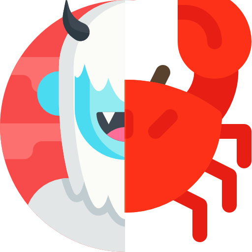

# OS Cards 


OS Cards is a flashcard based, open-source, learning aid application intended to provide options for targeting an individual's preferred learning style - i.e. visual, auditory, kinesthetic, etc.
 

<br><br>

## Installation
<hr>
<br>

- Fork from this orginizational repository (should you be interested in contributing to this project) 
- Clone the repository to your local terminal and access the project from within your preferred IDE or code editor (e.g. VS Code, Atom, Sublime)
- Use the following commands to have node package manager install application dependencies and initialize the development server :

```bash
npm install 
npm run dev
```
<br>

## Contributing to OS Cards

<hr>
<br>

- Create your feature branch local to your terminal
```bash
git checkout -b feature/<name your feature>
```
- Commit your changes 
```bash
git commit -m 'feature branch description'
```
- Push to your Github repository 
```bash
git push origin feature/fooBar
```
- Create a new Pull Request
<br><br>

## Notes to Prospective Contributors
<hr>
<br>

## Front End Notes
- Component have their own independent sheets to implement styling
- Each Component also is routed to their associated index.js file
- We have implemented Bootstrap 5 into our styling, please see this link for reference: 
<br>[https://getbootstrap.com/docs/5.0/getting-started/introduction/]
- All requests to our backend/database are through Axios:<br> [https://github.com/axios/axios] 
- To route between our pages, we used React Routers, for reference to docs, look here: <br>[https://reactrouter.com/web/guides/quick-start]
- For reference to our use of 'this.props.location.state' refer to: <br>[https://reactrouter.com/web/api/location] 


## Front End Stretch Features
- Provide flashcard text-to-speech functionality: (look at the Google text-to-speech API for reference: <br>[https://any-api.com/googleapis_com/speech/docs/API_Description])
- Provide gifs/images in addition to text: <br> [giphy-API:https://developers.giphy.com/docs/api#endpoint]
- Provide haptic touch response for mobile user interaction:<br> [https://developer.apple.com/design/human-interface-guidelines/ios/user-interaction/haptics/], <br>[https://medium.com/better-programming/adding-haptics-to-your-app-57439c358e8e]
- Provide accelerometer response for mobile user interaction:<br> [https://developer.android.com/guide/topics/sensors/sensors_overview]
- Provide a more robust UX implementing additional styling and/or motion design features
- Provide delete and update functionality to the DECK component
- Provide a "quiz" style component rendering individual flashcards showing only term or definition; tap/click to flip; swipe to deal new card
- Create a social network of users to share saved decks
<br>
<hr>

## Back-End Features
- Predominant backend packages: Express and Mongoose.<br>
[https://expressjs.com/], [https://mongoosejs.com/docs/] 
- All persistent data is stored in a Mongo DB Atlas server. <br> [https://docs.mongodb.com/manual/introduction/]
- Web page is connected to Mongo DB Atlas via a 'mongoURI'. *The existing 'mongoURI' is private and a new database cluster must be established in any future iterations of osCards.** 
- In the current iteration of OSCards, all data is stored in a single 'cards' collection; individual card documents are structured per the 'cardSchema'. 
- The server is comprised of a main server.js file that directs requests to the proper router; the router in turn directs these requests to the appropriate controller file. 
- The server is setup to handle: 
  - POST requests to create a new document in the MongoDB database. 
  - GET requests to retrieve data from MongoDB.

## Back-End Stretch Features
- Provide OAuth functionality: <br>[https://developers.google.com/identity/protocols/oauth2/javascript-implicit-flow]
- Enable users to 'copy' other users' existing decks. 
- Modify 'cardSchema' to allow non-text data to be stored in 'card' documents.  
- Handle PUT requests to modify the contents of an existing 'card' document.
- Handle DELETE requests to delete a 'card' document from the 'cards' collection. 
- Handle DELETE and PUT requests to delete or modify a deck.  
- Restructure database to accommodate multiple users. 
- Serve deck data to the frontend as a doubly-linked-list to enable "quiz" mode. Doubly-linked-list data structure will enable forward and backward progression through a queue of cards. 
- Randomize the order of cards in "quiz" mode. 

https://github.com/OSLearning/OSCards
